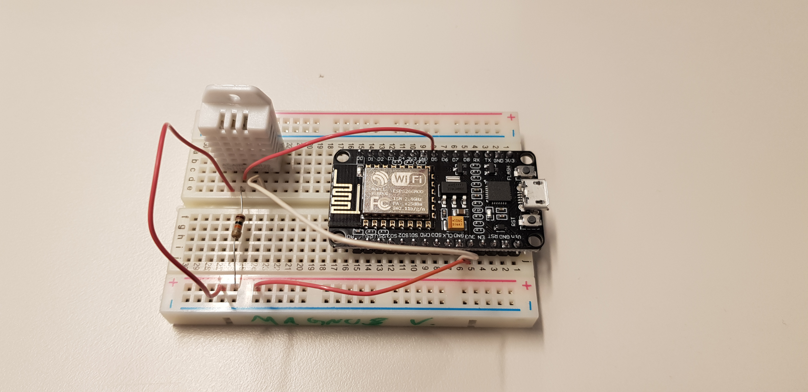

# ESP8266 Temperatur and humidity sensor


 
 In this project I will make a temperatur and humidity sensor with the DHT22 and NodeMCU ESP8266.
 
# What you need for this project
 * [NodeMCU ESP8266 Development board](https://www.ebay.com/sch/i.html?_from=R40&_trksid=m570.l1313&_nkw=nodemcu+esp8266+esp-12+v3&_sacat=65507&LH_TitleDesc=0&_osacat=65507&_odkw=nodemcu+esp8266+esp-12)
 * [DHT22 module](https://www.adafruit.com/product/385)
 * [4.7K Resistor(included with the part above)](https://www.ebay.com/sch/i.html?_from=R40&_trksid=m570.l1313&_nkw=4.7k+resistor&_sacat=0)
 * Breadboard
 * Wires

 # The Circuit Diagram
 Made using Fritzing
 
 

# Code Used
```cpp
// Code For ESP8266 + DHT22 Temperatur and Humidity sensor colection using Blynk APP.
// Used Exampel code from Adafruit and Blynk to make this sketch.

// DHT Temperature & Humidity Sensor
// Unified Sensor Library Example
// Written by Tony DiCola for Adafruit Industries
// Released under an MIT license.

// REQUIRES the following Arduino libraries:
// - DHT Sensor Library: https://github.com/adafruit/DHT-sensor-library
// - Adafruit Unified Sensor Lib: https://github.com/adafruit/Adafruit_Sensor

#define BLYNK_PRINT Serial


#include <ESP8266WiFi.h>
#include <BlynkSimpleEsp8266.h>
char auth[] = "AUTH_CODE_HERE"; // Put in your authorization code you got in you email.

// Your WiFi credentials.
// Set password to "" for open networks.
const char* ssid = "SSID_HERE"; // Put in your WiFi SSID here
const char* pass = "PASSWORD"; // Put in your WiFi Password here


#include <Adafruit_Sensor.h>
#include <DHT.h>
#include <DHT_U.h>

#define DHTPIN 14  // GPIO 14 is D5 on ESP8266
// Digital pin connected to the DHT sensor 
// Feather HUZZAH ESP8266 note: use pins 3, 4, 5, 12, 13 or 14 --
// Pin 15 can work but DHT must be disconnected during program upload.

// Uncomment the type of sensor in use:
//#define DHTTYPE    DHT11     // DHT 11
#define DHTTYPE    DHT22     // DHT 22 (AM2302)
//#define DHTTYPE    DHT21     // DHT 21 (AM2301)

DHT_Unified dht(DHTPIN, DHTTYPE);

uint32_t delayMS;

void setup() {
  Serial.begin(9600);
  Blynk.begin(auth, ssid, pass); // Starting Blynk Library

  
  // Initialize device.
  dht.begin();
  sensor_t sensor;
  dht.temperature().getSensor(&sensor);
  // Print humidity sensor details.
  dht.humidity().getSensor(&sensor);
  // Set delay between sensor readings based on sensor details.
  delayMS = sensor.min_delay / 2000;
}

void loop() {
  Blynk.run();
  // Delay between measurements.
  delay(delayMS);
  // Get temperature event and print its value.
  sensors_event_t event;
  dht.temperature().getEvent(&event);
  if (isnan(event.temperature)) {
    Serial.println(F("Error reading temperature!"));
  }
  else {
    Serial.print(F("Temperature: "));
    Serial.print(event.temperature);
    Serial.println(F("°C"));
    Blynk.virtualWrite(V0, event.temperature);
  }
  // Get humidity event and print its value.
  dht.humidity().getEvent(&event);
  if (isnan(event.relative_humidity)) {
    Serial.println(F("Error reading humidity!"));
  }
  else {
    Serial.print(F("Humidity: "));
    Serial.print(event.relative_humidity);
    Serial.println(F("%"));
    Blynk.virtualWrite(V1, event.relative_humidity);
  }
}
```
